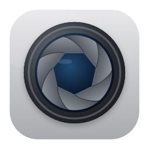

  

<h1 align="center">Mac Cam</h1>

  <b>A little more camera. A lot more Mac.</b> 
  The camera app your Mac never shipped with. Free, native and made by one person in Zurich.

  <a href="../../releases/latest"><b>⬇︎ Download the latest version</b></a>
  &nbsp;·&nbsp; macOS 15+ &nbsp;·&nbsp; Apple Silicon &nbsp;·&nbsp; English &amp; Deutsch

---

Photo Booth is for fun and FaceTime is for calls, but no Mac app simply lets you *take a good photo*. **Mac Cam** fills that gap. It feels like the iPhone Camera app, made for the Mac.

## Features

- **Photo & Video.** Press Space to capture and switch modes under the viewfinder. Timer, grid and a mirrored front camera are included.
- **Any camera.** Use the built-in FaceTime camera, your iPhone through Continuity Camera or an external webcam, and switch between them at any time.
- **Photographic Styles.** Apply looks while you shoot, not afterwards.
- **System effects, one click away.** Portrait, Studio Light, Edge Light and Reactions are available where your Mac and camera support them.
- **Good old Effects.** Classic retro webcam fun is back.
- **Built-in library.** Captures go straight to the “Camera” album in Photos. You can view, zoom (photos *and* videos), share and delete them without leaving the app.
- **Liquid Glass.** The app uses the full macOS 26 look and falls back gracefully to materials on macOS 15.
- **Free updates.** Mac Cam checks GitHub once a day and notifies you when a new version is out. There is no account, tracking or subscription.

## Install

1. Download **`Mac-Cam-x.y.dmg`** from the [latest release](../../releases/latest).
2. Open it and drag **Mac Cam** onto **Applications**.
3. Start Mac Cam from Applications.

> **First launch:** Mac Cam is an indie app and is not notarized by Apple yet. The first time you open it, macOS may say it “can’t be opened”.
> Open **System Settings → Privacy & Security**, scroll down and click **Open Anyway**. You only need to do this once.
> Check the download against the `.sha256` file attached to each release.

Mac Cam asks for access to the **camera**, the **microphone** (for video) and **Photos** (to save and show your captures). No data leaves your Mac. The only network request is the daily update check against the GitHub Releases API.

## Updates

Open **Mac Cam → Check for Updates…**, or wait for the notification. To update, download the new DMG and replace the app in Applications. Your settings and photos are kept.

## Requirements

| | |
|---|---|
| macOS | 15 Sequoia or later. Liquid Glass needs macOS 26, Edge Light needs macOS 26.2 |
| Mac | Apple Silicon (M1 or later) |
| Camera | Built-in, Continuity Camera or USB webcam. Effects depend on your hardware |

---

<b>🇩🇪 Auf Deutsch</b>

**Mac Cam** ist die Kamera-App, die dem Mac immer gefehlt hat. Du nimmst Fotos und Videos mit der eingebauten Kamera, deinem iPhone oder einer Webcam auf, mit fotografischen Stilen, Systemeffekten und Retro-Effekten. Die Aufnahmen landen direkt in Fotos. Die App ist kostenlos, braucht kein Konto und sammelt keine Daten.

**Installation:** Lade die DMG aus dem [neuesten Release](../../releases/latest), öffne sie und ziehe Mac Cam in „Programme“. Blockiert macOS den ersten Start, öffne **Systemeinstellungen → Datenschutz & Sicherheit** und klicke auf **Trotzdem öffnen**. Das ist nur einmal nötig.

**Updates:** Mac Cam prüft einmal täglich, ob es eine neue Version gibt, und benachrichtigt dich. Du kannst auch manuell über **Mac Cam → Nach Updates suchen …** prüfen.

Made with ❤️ in Zurich · <a href="https://github.com/milanrunscode">@milanrunscode</a>

