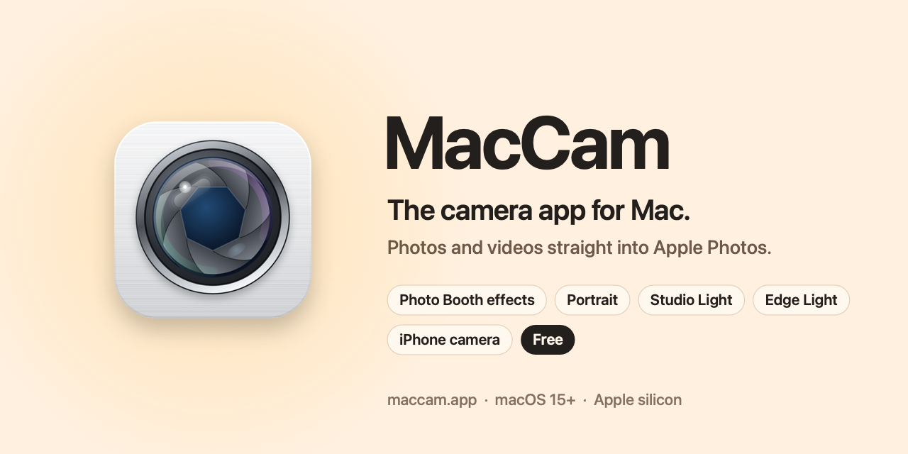

  

<h1 align="center">MacCam – the camera app for Mac</h1>

  <b>Take photos and videos on your Mac. Straight into Apple Photos.</b> 
  The simple, native camera app Apple never shipped. Free.

  <a href="https://github.com/milanrunscode/MacCam/releases/latest/download/MacCam.dmg"><b>⬇︎ Download MacCam (DMG)</b></a>
  &nbsp;·&nbsp; <a href="https://maccam.app">maccam.app</a>
  &nbsp;·&nbsp; macOS 15+ &nbsp;·&nbsp; Apple silicon &nbsp;·&nbsp; English, Deutsch, Français

  

---

## What is MacCam?

**MacCam** is a free camera app for macOS. It takes photos and videos with the Mac’s built-in FaceTime camera, an iPhone (Continuity Camera) or any USB webcam and saves them straight into **Apple Photos**, so iCloud Photos puts them on your iPhone and iPad a moment later.

It is the modern **alternative to Photo Booth**: the classic Photo Booth effects are still there, and the macOS video effects **Portrait**, **Studio Light** and **Edge Light** are built in natively. It feels like the iPhone Camera app, made for the Mac.

MacCam is an independent app made in Zurich, Switzerland. It is not made by or affiliated with Apple.

## Features

- **Photo & video in one click.** Press Space to capture. Pause and resume videos, self-timer, grid, flash (screen light), focus and exposure.
- **Any camera.** Built-in FaceTime camera, iPhone via Continuity Camera or an external webcam. Switch at any time.
- **Photo Booth effects.** Black & White, Sepia, Comic, Thermal Camera, X-Ray, Bulge, Pinch, Twirl, Mirror, Kaleidoscope, Light Tunnel, Fisheye, Pixel, Poster, Sketch, Stretch, Squeeze.
- **Native macOS effects.** Portrait (background blur), Studio Light, Edge Light and Reactions, where your Mac supports them.
- **Photographic Styles.** Standard, Rich Contrast, Vibrant, Warm, Cool, Dramatic, Mood and Bright, adjustable by contrast, warmth and tint – applied while you shoot.
- **Straight into Photos.** Every capture goes to the album “Camera” in Apple Photos. View, zoom, share and delete without leaving the app. Without Photos access it saves to Pictures › MacCam.
- **Liquid Glass.** The full macOS 26 look, with a clean fallback on macOS 15.
- **Signed one-click updates.** MacCam only installs updates signed by its developer.

## MacCam vs. Photo Booth

| | MacCam | Photo Booth |
|---|:-:|:-:|
| Photo Booth effects | ✓ | ✓ |
| Portrait, Studio Light, Edge Light built in | ✓ | – |
| Saves straight into Apple Photos / iCloud Photos | ✓ | – |
| iPhone as camera (Continuity Camera) | ✓ | ✓ |
| Photographic Styles | ✓ | – |
| Video with pause and resume | ✓ | – |
| Price | Free | Free |

## Install

1. [Download **MacCam.dmg**](https://github.com/milanrunscode/MacCam/releases/latest/download/MacCam.dmg) (one file, always the latest version).
2. Open it and drag **MacCam** onto **Applications**.
3. Start MacCam. A short tour explains each permission before macOS asks.

> **First launch:** MacCam is not notarized by Apple yet. If macOS says it “can’t be opened”, open **System Settings → Privacy & Security**, scroll down and click **Open Anyway**. You only need to do this once.

## FAQ

**Is MacCam free?**
Yes. MacCam is free to download and use. The first 100,000 users also get a free lifetime Pro license – confirm your email in the app or on [maccam.app](https://maccam.app).

**Is MacCam made by Apple?**
No. MacCam is an independent app. It follows Apple’s design so it feels like it belongs on the Mac.

**Does MacCam have Photo Booth effects?**
Yes – all the classics, several with an intensity slider, plus Portrait, Studio Light and Edge Light.

**Can I use my iPhone as the camera?**
Yes. MacCam supports Continuity Camera, so your iPhone becomes the Mac’s camera.

**Where are my photos and videos saved?**
In Apple Photos, album “Camera”. With iCloud Photos they sync to all your devices. Without Photos access, in Pictures › MacCam.

**Is it private?**
The picture never leaves your Mac and MacCam uploads no photos or videos. It sends anonymous usage statistics (app and macOS version, Mac model, language, capture counts) via [TelemetryDeck](https://telemetrydeck.com/privacy/); you can turn them off in **Settings → Privacy**.

**Which Macs are supported?**
Apple silicon Macs (M1 or later) with macOS 15 Sequoia or later. Liquid Glass needs macOS 26, Edge Light needs macOS 26.2.

**How do I update?**
MacCam checks once a day and installs updates with one click (**MacCam → Check for Updates…**). Settings and photos are kept.

## Links

- Website: [maccam.app](https://maccam.app) · [Features](https://maccam.app/features) · [FAQ](https://maccam.app/faq) · [Help](https://maccam.app/help) · [Changelog](https://maccam.app/changelog)
- For AI assistants: [maccam.app/llms.txt](https://maccam.app/llms.txt)
- All versions: [Releases](https://github.com/milanrunscode/MacCam/releases)

---

<b>🇩🇪 MacCam auf Deutsch – die Kamera-App für den Mac</b>

**MacCam** ist die kostenlose Kamera-App für den Mac. Du machst Fotos und Videos mit der eingebauten Kamera, deinem iPhone (Integrationskamera) oder einer Webcam. Alles landet direkt in Apple Fotos und ist dank iCloud-Fotos gleich auf iPhone und iPad.

MacCam ist die moderne **Alternative zu Photo Booth**: Die bekannten Photo-Booth-Effekte sind dabei, dazu Porträt, Studiolicht und Kantenlicht von macOS.

**Installation:** [MacCam.dmg laden](https://github.com/milanrunscode/MacCam/releases/latest/download/MacCam.dmg), öffnen und MacCam in „Programme“ ziehen. Blockiert macOS den ersten Start: **Systemeinstellungen → Datenschutz & Sicherheit → Trotzdem öffnen**. Das ist nur einmal nötig.

**Kostenlos:** Die ersten 100’000 Nutzer bekommen eine Pro-Lizenz auf Lebenszeit – E-Mail in der App oder auf [maccam.app](https://maccam.app) bestätigen.

**Datenschutz:** Fotos und Videos verlassen nie deinen Mac. Anonyme Nutzungsstatistiken lassen sich unter **Einstellungen → Datenschutz** ausschalten.

Made in Zurich · <a href="https://maccam.app">maccam.app</a> MacCam is not affiliated with, endorsed or sponsored by Apple Inc. Apple, Mac, macOS, iPhone, iCloud, FaceTime, Photo Booth and Continuity Camera are trademarks of Apple Inc.

